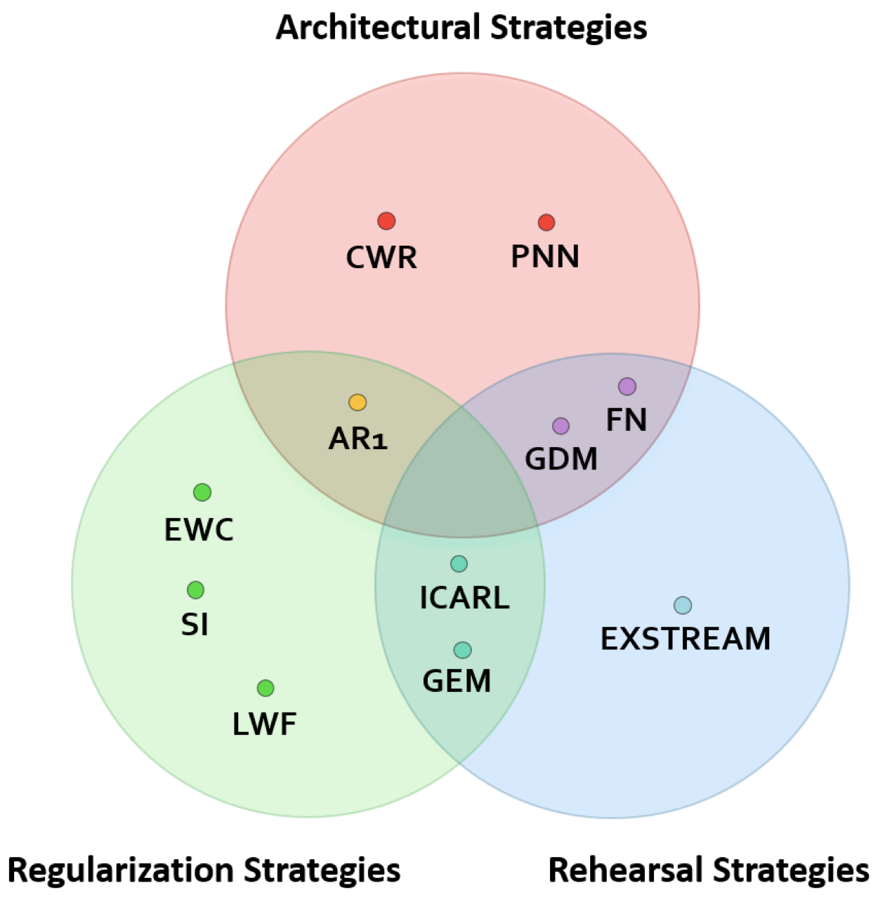

# Gradient-Episodic-Memory-for-Continual-Learning

This project was developed as part of the CS-GY-6613 Artificial Intelligence course at NYU Tandon School of Engineering. Code can be found in [GEM.ipynb](https://github.com/jmg764/Gradient-Episodic-Memory-for-Continual-Learning/blob/master/GEM.ipynb).

## Continual Learning
Continual learning is a subset of AI focused on the ability of a model to continually learn from streams of high dimensional data. Humans have this built-in: over the course of our lifetimes, we continually acquire, fine-tune, and transfer skills and knowledge. Achieving this same capability is crucial for computational systems and autonomous agents interacting in the real world, and is also a major challenge in the field of AI. 

While common deep learning architectures excel at a number of classification and regression tasks using a large dataset, that dataset must be present during the training phase, and the whole network must be *retrained* whenever the underlying distribution of data changes. This contributes to **catastrophic forgetting**: the tendency of a neural network to completely and abruptly forget old information when learning new information. Thus, the challenge lies in developing models which can smoothly update their predictions while retaining previously obtained knowledge deemed to be useful.

There are three main types of approaches for mitigating catastrophic forgetting:
<ol start="1">
    <li><b>Regularization strategies</b>: retraining the whole network using regularization constraints to discourage the loss of previously learned tasks.</li>
    <li><b>Architectural strategies</b>: specific architectures, layers, activation functions, and/or weight- freezing strategies are used to mitigate forgetting.</li>
    <li><b>Rehearsal strategies</b> past information is periodically replayed to the model to strengthen connections for memories it has already learned.</li>
</ol>

Figure from <a href="https://arxiv.org/abs/1806.08568" target="_blank">[1]</a>.

This project focuses on gradient episodic memory (GEM), shown above to contain elements of regularization and rehearsal strategies. Here, we implement GEM using a variant of the MNIST dataset in which digits are rotated by a fixed angle between 0 and 180 degrees. GEM minimizes catastrophic forgetting through use of an episodic memory used to store a subset of the observed examples from a given task. While minimizing the loss on the current task *t*, GEM treats the losses on the episodic memories of tasks *k < t* as inequality constraints, avoiding their increase but allowing their decrease <a href="https://arxiv.org/abs/1802.07569" target="_blank">[2]</a>.

Here, we're evaluating our GEM model based on the following: 

1. *Average accuracy*: the average number of correctly classified MNIST digits out of the total number MNIST digits seen by the model.
2. *Backward transfer (BWT)*: the influence that learning a new task has on the performance of a previous task. A negative backward transfer decreases performace on some preceding task, therefore revealing the extent to which there was catastrophic forgetting.
3. *Forward transfer (FWT)*: the influence that learning a new task has on the performance of a future task.

The following approach is based off of this paper <a href="https://arxiv.org/abs/1706.08840" target="_blank">[3]</a>.
